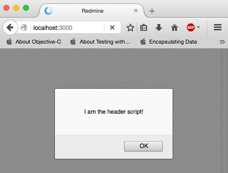
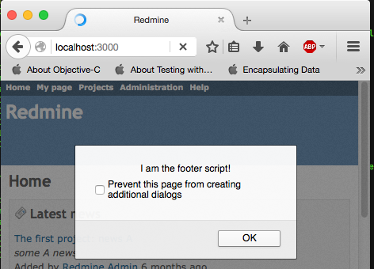

# Using header and footer hooks to add content to the base page

1. Generate the plugin

  $> ./bin/rails generate redmine_plugin header_footer_include_test

2. append the line to /init.rb:

    require_dependency 'header_footer_include_test_hooks_listener'

3. create the file [lib/header_footer_include_test_hooks_listener.rb](lib/header_footer_include_test_hooks_listener.rb)

4. create the file [/app/assets/javascripts/header.js](/app/assets/javascripts/header.js)

5. create the file [/app/assets/javascripts/footer.js](/app/assets/javascripts/footer.js)

6. 'Compile' the plugin

  $> rake redmine:plugins:migrate RAILS_ENV=production

7. test it out

  $> ./bin/rails server

  visit localhost:3000

  

  
